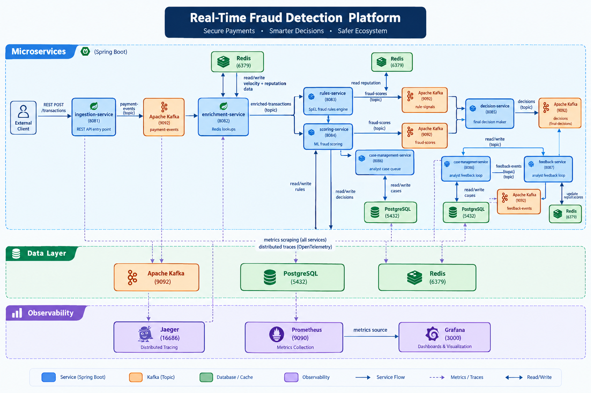
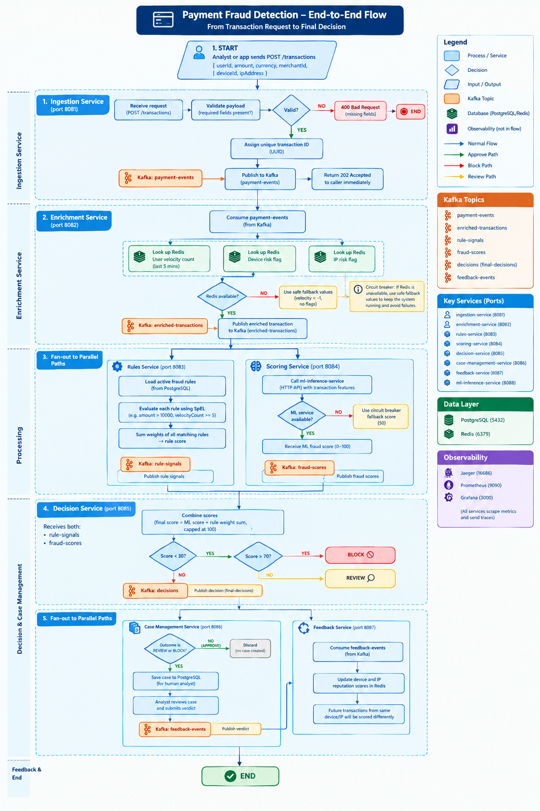

# Fraud Detection Platform

A real-time system that checks every payment transaction for fraud and decides whether to **approve**, **review**, or **block** it — all within milliseconds.

Built with Java 17, Spring Boot 3, Apache Kafka, Redis, and PostgreSQL.

---

## Architecture Diagram



> Shows all 8 microservices, Kafka topics, PostgreSQL, Redis, and the observability stack (Jaeger, Prometheus, Grafana) and how they connect to each other.

---

## Transaction Flowchart



> Traces the full journey of a single payment — from the moment it arrives at the API, through enrichment, rules evaluation, ML scoring, and the final APPROVE / REVIEW / BLOCK decision.

---

## What does this system do?

When someone makes a payment, this platform:

1. Receives the transaction
2. Looks up history about the user, device, and IP address
3. Runs fraud rules against it (e.g. "amount over $10,000" or "5 transactions in 5 minutes")
4. Scores it with an ML model (0–100, higher = more suspicious)
5. Makes a final decision: **APPROVE**, **REVIEW**, or **BLOCK**
6. If flagged, creates a case for a human analyst to investigate
7. Learns from analyst feedback to improve future decisions

The whole pipeline runs asynchronously through Kafka — each step is a separate service that does one job.

---

## How a transaction flows through the system

```
Your App
   │
   │  POST /transactions
   ▼
┌─────────────────────┐
│  ingestion-service  │  Receives the transaction, gives it a unique ID, puts it on the queue
└─────────────────────┘
          │
          │  Kafka: payment-events
          ▼
┌─────────────────────┐
│  enrichment-service │  Looks up Redis: how many transactions has this user made recently?
└─────────────────────┘  Is this device or IP flagged?
          │
          │  Kafka: enriched-transactions
          ├──────────────────────────────────────────┐
          ▼                                          ▼
┌──────────────────┐                    ┌─────────────────────┐
│  rules-service   │                    │  scoring-service    │
│                  │                    │                     │
│  Checks rules    │                    │  Runs ML model      │
│  like:           │                    │  Returns a fraud    │
│  - amount > $10k │                    │  score 0–100        │
│  - velocity > 5  │                    └─────────────────────┘
└──────────────────┘                              │
          │                                       │
          │  rule-signals                         │  fraud-scores
          └──────────────┬────────────────────────┘
                         ▼
              ┌─────────────────────┐
              │  decision-service   │  Combines rules + score → APPROVE / REVIEW / BLOCK
              └─────────────────────┘
                         │
                         │  Kafka: decisions
                         ├──────────────────────────────────────┐
                         ▼                                      ▼
          ┌──────────────────────────┐          ┌──────────────────────┐
          │  case-management-service │          │  feedback-service    │
          │                          │          │                      │
          │  Saves REVIEW/BLOCK      │          │  Analysts submit     │
          │  cases to Postgres for   │          │  verdicts here to    │
          │  human analysts          │          │  improve the model   │
          └──────────────────────────┘          └──────────────────────┘
```

---

## Services explained

| Service | Port | What it does |
|---|---|---|
| `ingestion-service` | 8081 | The front door. Accepts transactions via REST, validates them, and publishes to Kafka |
| `enrichment-service` | 8082 | Fetches context from Redis: transaction velocity, device reputation, IP reputation |
| `rules-service` | 8083 | Stores and evaluates fraud rules. Rules can be added/changed live without restarting |
| `scoring-service` | 8084 | Calls the ML model and computes a fraud score (0 = clean, 100 = fraud) |
| `decision-service` | 8085 | Combines rule signals + ML score into a final APPROVE / REVIEW / BLOCK decision |
| `case-management-service` | 8086 | Saves flagged transactions to Postgres so analysts can investigate them |
| `feedback-service` | 8087 | Accepts analyst verdicts and updates Redis reputation data for future scoring |
| `ml-inference-service` | 8088 | The ML model server (runs in Docker) |

---

## Infrastructure

| What | Used for | Port |
|---|---|---|
| **Apache Kafka** | Message queue between all services | 9092 |
| **PostgreSQL** | Stores fraud rules, cases, and analyst decisions | 5432 |
| **Redis** | Stores transaction velocity and device/IP reputation (fast lookups) | 6379 |
| **Jaeger** | Distributed tracing — see a request travel across all services | 16686 |
| **Prometheus** | Collects metrics from all services | 9090 |
| **Grafana** | Dashboards for metrics | 3000 |

---

## Kafka topics

| Topic | Who writes | Who reads |
|---|---|---|
| `payment-events` | ingestion-service | enrichment-service |
| `enriched-transactions` | enrichment-service | rules-service, scoring-service |
| `rule-signals` | rules-service | decision-service |
| `fraud-scores` | scoring-service | decision-service |
| `decisions` | decision-service | case-management-service, feedback-service |
| `feedback-events` | case-management-service | feedback-service |
| `payment-events-dlq` | any service | dead-letter queue for failed messages |

---

## Decision logic

| Fraud score | Decision |
|---|---|
| Below 30 | ✅ APPROVE |
| 30 – 70 | 🔍 REVIEW (sent to analyst) |
| Above 70 | 🚫 BLOCK |

---

## Prerequisites

- [Docker Desktop](https://www.docker.com/products/docker-desktop/)
- Java 17+
- Maven 3.9+

---

## Running locally

### Step 1 — Copy environment config

```bash
copy .env.example .env
```

The defaults work out of the box for local development. No changes needed.

### Step 2 — Run everything

Double-click `start.bat`, or from a terminal:

```cmd
.\start.bat
```

This will:
- Start Kafka, Postgres, Redis, and all observability tools via Docker
- Wait for Kafka to be ready
- Create all Kafka topics
- Start all 7 Spring Boot microservices in separate windows
- Print a health check summary after 45 seconds

### Step 3 — Verify everything is up

```
-- Health checks --
  [ OK ] ingestion-service       :8081
  [ OK ] enrichment-service      :8082
  [ OK ] rules-service           :8083
  [ OK ] scoring-service         :8084
  [ OK ] decision-service        :8085
  [ OK ] case-management-service :8086
  [ OK ] feedback-service        :8087
```

If any service shows `[FAIL]`, check `logs\<service-name>.log` for the error.

---

## Sending a test transaction

```bash
curl -X POST http://localhost:8081/transactions \
  -H "Content-Type: application/json" \
  -d '{
    "userId": "user-123",
    "amount": 250.00,
    "currency": "USD",
    "merchantId": "merchant-456",
    "deviceId": "device-789",
    "ipAddress": "192.168.1.1"
  }'
```

You'll get back a `202 Accepted` immediately. The decision flows through the pipeline asynchronously.

---

## Fraud rules

Rules are stored in Postgres and evaluated using Spring Expression Language (SpEL). They can be added, changed, or disabled **without restarting any service**.

### Add a rule

```bash
curl -X POST http://localhost:8083/rules \
  -u analyst:analyst \
  -H "Content-Type: application/json" \
  -d '{
    "name": "High amount",
    "conditionExpression": "amount > 10000",
    "weight": 40
  }'
```

### Evaluate rules against a transaction

```bash
curl -X POST http://localhost:8083/rules/evaluate \
  -u analyst:analyst \
  -H "Content-Type: application/json" \
  -d '{"amount": 15000, "velocityCount": 2}'
```

Rules use these fields: `amount`, `velocityCount`, `deviceRiskFlags`, `ipRiskFlags`.

The `weight` of each matching rule is summed and contributes to the final fraud score.

---

## Observability

| Tool | URL | Credentials |
|---|---|---|
| Grafana dashboards | http://localhost:3000 | admin / admin |
| Prometheus metrics | http://localhost:9090 | — |
| Jaeger traces | http://localhost:16686 | — |

Every service exposes metrics at `/actuator/prometheus` and sends traces to Jaeger via OpenTelemetry.

---

## Log files

All service logs are written to the `logs\` folder:

```
logs\
  ingestion.log
  enrichment.log
  rules.log
  scoring.log
  decision.log
  case-management.log
  feedback.log
```

---

## Environment variables

All variables live in `.env` (copied from `.env.example`):

| Variable | Default | Used by |
|---|---|---|
| `POSTGRES_DB` | `frauddb` | Docker / Postgres |
| `POSTGRES_USER` | `fraud` | Docker / Postgres |
| `POSTGRES_PASSWORD` | `fraud` | Docker / Postgres |
| `SPRING_DATASOURCE_URL` | `jdbc:postgresql://localhost:5432/frauddb` | rules, scoring, decision, case-management |
| `SPRING_DATASOURCE_USERNAME` | `fraud` | same as above |
| `SPRING_DATASOURCE_PASSWORD` | `fraud` | same as above |
| `SPRING_KAFKA_BOOTSTRAP_SERVERS` | `localhost:9092` | all services |
| `RULES_ANALYST_USER` | `analyst` | rules-service Basic Auth |
| `RULES_ANALYST_PASSWORD` | `analyst` | rules-service Basic Auth |
| `CASE_ANALYST_USER` | `analyst1` | case-management Basic Auth |
| `CASE_ANALYST_PASSWORD` | `analyst1pass` | case-management Basic Auth |
| `CASE_ADMIN_USER` | `admin1` | case-management Basic Auth |
| `CASE_ADMIN_PASSWORD` | `admin1pass` | case-management Basic Auth |
| `GRAFANA_ADMIN_PASSWORD` | `admin` | Grafana |

---

## Project structure

```
fraud-platform/
├── ingestion-service/          Spring Boot service — REST intake
├── enrichment-service/         Spring Boot service — Redis lookups
├── rules-service/              Spring Boot service — SpEL rules engine
├── scoring-service/            Spring Boot service — ML scoring
├── decision-service/           Spring Boot service — final decision
├── case-management-service/    Spring Boot service — analyst case queue
├── feedback-service/           Spring Boot service — analyst feedback loop
├── ml-inference-service/       ML model server (runs in Docker)
├── common/                     Shared DTOs used by all services
├── docs/                       Architecture diagram and flowchart images
├── observability/              Prometheus config, Grafana dashboards
├── k8s/                        Helm chart for Kubernetes deployment
├── load-test/                  k6 load test scripts
├── logs/                       Runtime logs (created on first run)
├── docker-compose.yml          Infrastructure containers
├── start.bat                   One-click startup script
└── .env.example                Environment variable template
```

---

## Rebuilding after code changes

```bash
mvn clean install -DskipTests
```

Then re-run `start.bat`.

---

## Kubernetes / Production

See `k8s/` for the Helm chart. It deploys all services plus Kafka, Postgres, and Redis with autoscaling via KEDA (Kafka consumer lag) and Kubernetes HPA (CPU).

For managed AWS infrastructure, set `kafka.useManaged=true` to use Amazon MSK instead of the in-cluster Kafka.
